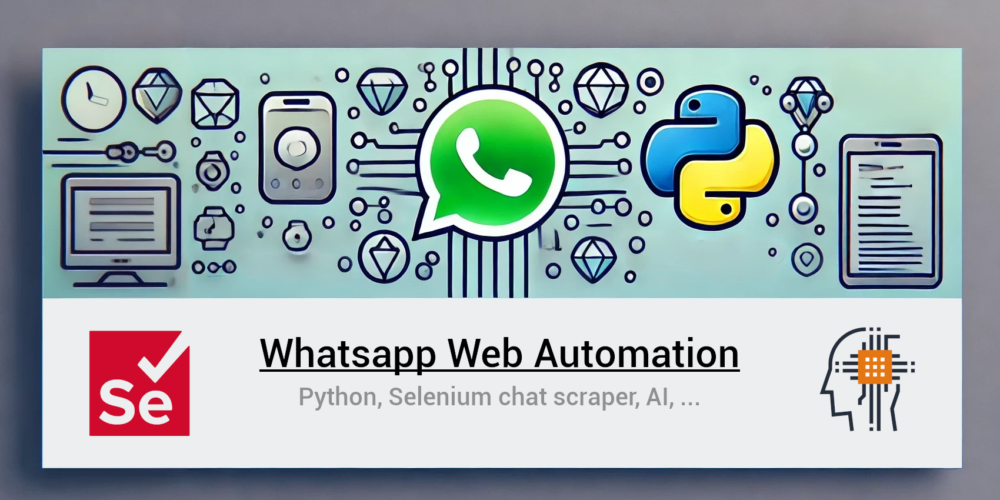

# WhatsApp Web Automation with Python and Selenium



## Description

WhatsApp does not provide an API for automating interactions with chats. This project aims to address this gap by using Python and Selenium to automate WhatsApp Web interaction. The goal is to integrate OpenAI's artificial intelligence functionalities to respond to chat messages based on specific contexts and user settings. Currently, the code focuses on extracting and classifying chat messages. Future enhancements include optimizing functions and saving messages and configurations in a database.

**Important Note:** WhatsApp's policy prohibits the use of automated systems and spam. This is an experimental project and is not intended for spamming purposes. Use it responsibly. I do not take any responsibility for the misuse of this project.


## Features

- **Message Extraction:** Extracts messages from a specified WhatsApp chat.
- **Message Classification:** Classifies messages based on their type (IN/OUT, text, image, video, reply etc.).
- **Message Saving:** Saves extracted messages in a JSON file.
- **Language Support:** Currently supports Italian and English language settings (check date format).

## Future Enhancements

- **AI Integration:** Integrate OpenAI functionalities to respond to messages.
- **Database Integration:** Save messages and configurations in a database.
- **Function Optimization:** Optimize existing functions for better performance.


## Installation

1. **Clone the repository:**

    ```bash
    git clone https://github.com/Jersk/Whatsapp-Web-Automation-Python-AI.git
    cd whatsapp-web-automation
    ```

2. **Set up a virtual environment:**

    ```bash
    python -m venv venv
    source venv/bin/activate  # On Windows use `venv\Scripts\activate`
    ```

3. **Install dependencies:**

    ```bash
    pip install -r requirements.txt
    ```

4. **Set up Chrome WebDriver:**

    - Download the Chrome WebDriver compatible with your version of Chrome from [here](https://sites.google.com/a/chromium.org/chromedriver/downloads).
    - Place the `chromedriver` executable in the `chrome` directory within the project.

5. **Configure user data:**

    - Ensure that you have logged into WhatsApp Web on Chrome.
    - Copy the user data directory path of your Chrome profile and update it in the script.

## Usage

1. **Update Constants:**

    - Open the script and update the `CHAT_NAME` constant with the full name of the chat you want to automate.

2. **Run the script:**

    ```bash
    python main.py
    ```

3. **The script will:**

    - Open WhatsApp Web.
    - Search for the specified chat.
    - Extract and classify messages.
    - Save the messages to `messages.json`.

## Additional Scripts

### misc.py

This file contains various notes and tests, serving as starting points for other functions. It includes:

- **User Class:** Manages user-specific MySQL databases and settings.
- **Database Functions:** Functions to interact with MySQL databases.
- **Message Processing:** Functions to process chat messages with OpenAI.
- **Audio Processing:** Functions to translate audio messages to text.
- **Response Generation:** Functions to generate responses for messages using OpenAI.

**Note:** This file is experimental and may contain incomplete or confusing code. However, it could be useful as a reference or starting point for developing additional features.

## Code Overview

- **Main Functionality:**

    - `main()`: The entry point of the script.
    - `search_messages()`: Searches and extracts messages from the chat.
    - `get_message_data()`: Retrieves detailed data for each message.
    - `save_message_data()`: Saves message data to a JSON file.

- **Helper Functions:**

    - `generate_message_id()`: Generates a unique ID for each message.
    - `load_messages()`: Loads messages from the JSON file.
    - `get_last_saved_message()`: Retrieves the last saved message.
    - `search_contact()`: Searches for the specified contact in WhatsApp Web.
    - `get_chat_container()`: Opens the chat and scrolls to the last saved message.
    - `scroll_to_top()`: Scrolls to the top of the chat to find the last saved message.
    - `get_message_type()`: Determines the type of message.
    - `get_message_text()`: Extracts the text of the message.
    - `extract_and_update_datetime()`: Extracts and updates the datetime of the message.

## License

This project is licensed under the Creative Commons Attribution-NonCommercial 4.0 International (CC BY-NC 4.0). See the [LICENSE](LICENSE) file for details.


## Contributing

Contributions are welcome!

## Acknowledgments

- [Selenium](https://www.selenium.dev/) - Browser automation framework.
- [OpenAI](https://www.openai.com/) - AI functionalities for future integration.
